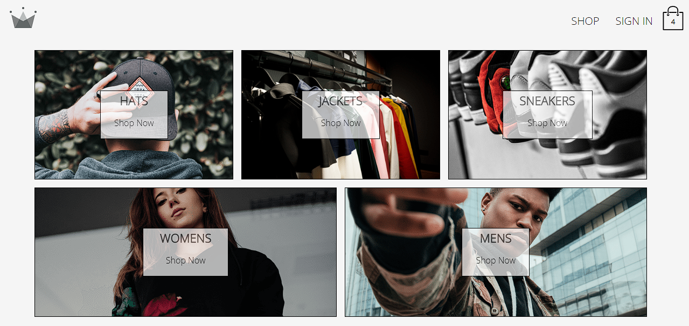

# Crwn Clothing Store

## About the project

This is an E-commerce application created using React, Redux, React Router, Context API, Firebase, Stripe + more.

With this app, you are able to select a category, add items to cart, and checkout and even handle payments.

- React

- React Router

- Redux

- Redux Saga

- Asynchronous Redux

- React Hooks

- Context API

- React Suspense + React Lazy

- Firebase

- Stripe API

- Styled-Components

## Visit the live website here:

[](https://crwn-clothingstore.netlify.app/)

## Frontend Technologies

Technologies that I used to develop this frontend app

- [ReactJS](https://reactjs.org)
- [Sass](https://sass-lang.com/)
- [Firebase](https://firebase.google.com/)
- [React Router](https://github.com/ReactTraining/react-router)
- [React Redux](https://react-redux.js.org/)
- [React Stripe](https://stripe.com/docs/stripe-js/react)
- [VS Code](https://code.visualstudio.com) with [ESLInt](https://eslint.org/docs/user-guide/getting-started), and [Prettier RC](https://github.com/prettier/prettier)

## Getting started

### Requirements

- [Node.js](https://nodejs.org/en/)
- [Yarn](https://classic.yarnpkg.com/) or [npm](https://www.npmjs.com/)

**Clone the project and access the folder**

```bash
$ git clone https://github.com/msemedo2/crwn-clothing.git
$ cd crwn-clothing
```

**Follow the steps below**

```bash
# Install dependencies
$ npm install
# Run the web app
$ npm start
```
